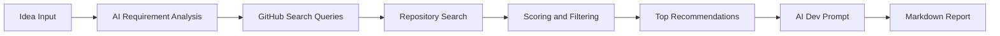

# DevDetective

> Search GitHub before you build from scratch.  
> 写代码前，先查 GitHub 有没有成熟轮子。

[](https://nextjs.org/)
[](https://www.typescriptlang.org/)
[](LICENSE)
[](./RELEASE_NOTES_v0.1.0.md)

DevDetective is an open-source pre-build investigation tool for the AI coding era.  
开发者在正式开工前，先输入产品想法，DevDetective 会搜索 GitHub 上的相似开源项目，比较维护状态、License、活跃度和可复用性，再生成可直接交给 Codex、Cursor、Claude Code 等工具的二次开发提示词。

## At a Glance | 一眼看懂

| English | 中文 |
| --- | --- |
| Input an app idea | 输入一个应用想法 |
| Search similar GitHub repos | 搜索相似 GitHub 项目 |
| Evaluate maintenance, license, and reuse value | 评估维护状态、License 和复用价值 |
| Generate a follow-up prompt for AI coding tools | 生成可交给 AI 编程工具的后续提示词 |

## Workflow | 工作流



中文理解：

1. 用户先描述要做什么。
2. 系统先拆解需求，再生成 GitHub 搜索词。
3. 搜索候选仓库并评估维护状态、License 和复用价值。
4. 输出 Top 推荐、AI 结论和一份可复制的开发提示词。

## Why It Feels Different | 它和普通搜索工具的区别

- It is not just a GitHub search box. It is a pre-build investigation workflow.
- It does not only rank by stars. It also checks push activity, maintenance freshness, and reuse fit.
- It is designed to work with AI coding assistants, not compete with them.

中文补充：

- 它不是普通的 GitHub 搜索框，而是一整套“开工前侦查流程”。
- 它不只看 Star，还看最近提交、维护状态和复用适配度。
- 它不是替代 AI 编程，而是给 AI 编程先做情报准备。

## What It Does | 它解决什么问题

Many ideas already have mature open-source implementations, but people still ask AI tools to build everything from scratch. That usually means more token cost, more trial and error, and worse decisions around reuse and licensing.

很多需求其实已经有成熟开源实现，但大家常常直接让 AI 从零开始写，结果往往是：

- higher token usage / 消耗更多 token
- half-finished prototypes / 更容易做出半成品
- missed reuse opportunities / 错过直接 fork 或局部复用的机会
- ignored maintenance and license risk / 忽略维护状态和 License 风险

DevDetective moves this investigation step to the front of the workflow.  
DevDetective 的目标，就是把这一步前置。

## Who It Is For | 适合谁用

- Developers using Codex, Cursor, or Claude Code
- Indie hackers and founders building MVPs quickly
- Teams that want to investigate before rewriting
- Agent workflows that should search first and code second

对应中文场景：

- 使用 Codex、Cursor、Claude Code 的开发者
- 需要快速做 MVP 的独立开发者和创业者
- 想先调研 GitHub 再决定是否重写的人
- 想把“开工前侦查”固化进 Agent 工作流的人

## Current Features | 当前能力

- Natural-language idea input in Chinese or English
- AI requirement analysis and GitHub query generation
- Similar repo search with basic safety filtering
- Maintenance signals: stars, forks, last push, last update, license
- Top recommendations with reuse scoring
- AI-generated follow-up prompt for coding assistants
- Markdown investigation report export
- Unified `/api/investigate` endpoint
- Bundled `devdetective-skill/` for agent workflows

中文总结：

- 支持中英文需求输入
- AI 拆解需求并生成 GitHub 搜索词
- 搜索相似仓库并做基础安全过滤
- 展示最近提交、最近更新、维护状态、Star、Fork、License
- 对候选项目做综合评分
- 生成 Top 推荐和 AI 开发提示词
- 导出 Markdown 侦查报告
- 提供统一的 `/api/investigate` 接口
- 提供可供 Agent 调用的 `devdetective-skill/`

## Online Demo | 在线体验

Live experience URL:

- [https://ai2work.xyz/DevDetective](https://ai2work.xyz/DevDetective)

当前仓库以本地运行和开源发布为主，同时提供 AI2Work 托管体验版用于快速试用与案例展示。

## Hosted Demo Limits | 托管体验版限制

For hosted mode, the current default is:

- 2 investigations per 6 hours for the same IP
- Top 5 results by default
- a gentle GitHub Star prompt on the 2nd successful investigation
- lightweight validation, not a replacement for the full local version

可通过环境变量启用：

```ini
HOSTED_EXPERIENCE_MODE=true
HOSTED_LIMIT_WINDOW_HOURS=6
HOSTED_MAX_QUERIES_PER_WINDOW=2
HOSTED_MAX_RESULTS=5
```

## Local Setup | 本地安装

```bash
git clone https://github.com/dadaleo/DevDetective.git
cd DevDetective
npm install
copy .env.example .env.local
```

Then edit `.env.local`:

```ini
DEEPSEEK_API_KEY=sk-your-deepseek-key
DEEPSEEK_BASE_URL=https://api.deepseek.com/v1

GITHUB_TOKEN=ghp_your_github_token

NEXT_PUBLIC_APP_NAME=DevDetective
DATABASE_URL=./data/devdetective.sqlite
```

Start the app:

```bash
npm run dev
```

Default URL:

- [http://localhost:4567](http://localhost:4567)

## Environment Variables | 环境变量

Required:

- `DEEPSEEK_API_KEY`
- `GITHUB_TOKEN`

Optional:

- `DEEPSEEK_BASE_URL`
- `OPENAI_API_KEY`
- `OPENAI_BASE_URL`
- `NVIDIA_API_KEY`
- `DATABASE_URL`
- `NEXT_PUBLIC_APP_NAME`

说明：

- `GITHUB_TOKEN` 用于提升 GitHub API 请求额度与稳定性
- 默认 AI Provider 走 DeepSeek
- `NVIDIA_API_KEY` 仅用于 README 批量总结分流，可不配置

## API | 接口

### `POST /api/investigate`

The unified investigation endpoint handles:

- requirement analysis
- GitHub search
- repo scoring
- prompt generation
- Markdown report generation

请求示例：

```json
{
  "idea": "我想做一个局域网文件快传网页",
  "techStack": ["Next.js"],
  "projectType": "Web 应用",
  "updatePreference": "最近 1 年有更新",
  "licensePreference": "MIT / Apache / BSD 等友好协议",
  "preferRecent": true,
  "maxResults": 10,
  "outputFormat": "markdown"
}
```

### `GET /api/health`

For deployment or hosted-demo health checks.

```json
{
  "status": "ok",
  "github_token_configured": true,
  "ai_provider_configured": true,
  "nvidia_configured": false
}
```

### `GET /api/examples`

Returns built-in example cases.

## Example Use Cases | 使用示例

- local file sharing / 局域网文件快传
- video transcript archive / 视频号转文字归档
- prompt and asset manager / 提示词素材管理器
- WeChat mini app UI generator / 微信小程序 UI 模板生成器
- GitHub tool radar / GitHub 工具雷达

## Screenshots | 截图展示


## Markdown Report Export | Markdown 报告导出

Each report can include:

- user request / 用户原始需求
- intent summary / 需求理解
- search queries / 搜索关键词
- similar repo list / 相似项目列表
- top recommendations / Top 推荐
- license risk note / License 风险提示
- AI development prompt / AI 开发提示词

## Agent Skill | Agent 配套 Skill

`devdetective-skill/` is designed for Codex, Cursor, Claude Code, and similar agent workflows.

它的用途不是替代网页，而是让 Agent 在“开始写代码前”先调用 DevDetective 的侦查流程。

See:

- [devdetective-skill/README.md](devdetective-skill/README.md)

Current status:

- the repository already includes the skill directory, scripts, examples, and usage docs
- the skill depends on a reachable DevDetective server plus a Python runtime with `requests`
- before sharing it broadly, run one full install-and-call verification on a clean machine

## Tech Stack | 技术栈

- Next.js 14
- React 18
- TypeScript
- Tailwind CSS
- sql.js
- GitHub REST API
- DeepSeek API

## Release Checklist | 发布前建议

- replace placeholder screenshots / 补产品截图
- confirm live AI2Work demo URL / 确认体验版地址
- keep `.env.local` out of version control / 确保 `.env.local` 未提交
- run `npm run lint` and `npm run build` before release
- verify `devdetective-skill/` on a clean Python environment / 在干净 Python 环境中完整验证 Skill

More deployment notes:

- [DEPLOYMENT.md](DEPLOYMENT.md)
- [RELEASE_NOTES_v0.1.0.md](RELEASE_NOTES_v0.1.0.md)

## License

MIT

See [LICENSE](LICENSE).

## Disclaimer | 免责声明

- Search and recommendation results are for reference only.
- License warnings are not legal advice.
- Please verify repository quality and license terms before production use.

中文补充：

- 搜索与推荐结果仅供参考
- License 风险提示不构成法律建议
- 正式使用前请自行验证目标仓库的质量与授权条款
